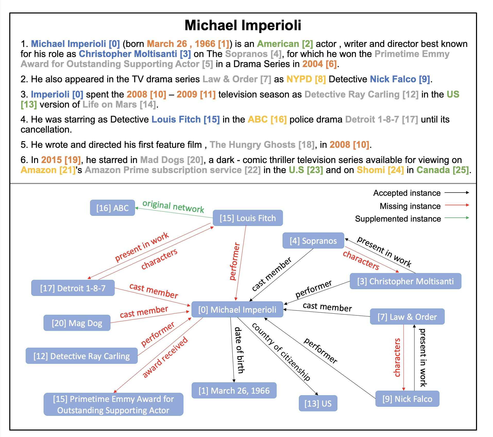

# Revisit-DocRED

Source code for ACL 2022 paper:  [Does Recommend-Revise Produce Reliable Annotations? An Analysis on Missing Instances in DocRED](https://arxiv.org/abs/2204.07980)

> DocRED is a widely used 
dataset for document-level relation extraction. In the large-scale annotation, a recommend-revise scheme is adopted to reduce the workload. Within this scheme, annotators are provided with candidate relation instances from distant supervision, and they then manually supplement and remove relational facts based on the recommendations. However, when comparing DocRED with a subset relabeled from scratch, we find that this scheme results in a considerable amount of false negative samples and an obvious bias towards popular entities and relations. Furthermore, we observe that the models trained on DocRED have low recall on our relabeled dataset and inherit the same bias in the training data.
Through the analysis of annotators' behaviors, we figure out the underlying reason for the problems above:
the scheme actually discourages annotators from supplementing adequate instances in the revision phase. We appeal to future research to take into consideration the issues with the recommend-revise scheme when designing new models and annotation schemes. 

## Findgings
1. Serious missing issue exists in DocRED, nearly two-thirds of triples are wrongly labeled as NA.
2. DocRED has bias, it favors relation-instances related to popular relations and entities.
3. Models trained on DocRED inherit such bias and their performances are over estimated.




## Data
We re-annotated 96 documents from the valid set of DocRED. They are labeled from scratch, not using recommendations.

You can find them in ./data/docred/valid_scratch.json

## Citation
If you use this work or code, please kindly cite the following papers:
```bib

@inproceedings{DBLP:conf/acl/Huang22,
  author    = {Quzhe Huang and
               Shibo Hao and
               Yuan Ye and
               Shengqi Zhu and
               Yansong Feng and
               Dongyan Zhao},
  title     = {Does Recommend-Revise Produce Reliable Annotations? An Analysis on
               Missing Instances in DocRED},
  booktitle = {Proceedings of the 60th Annual Meeting of the Association for Computational
               Linguistics, {ACL} 2022},
  publisher = {Association for Computational Linguistics},
  year      = {2022},
}

@inproceedings{DBLP:conf/acl/YaoYLHLLLHZS19,
  author    = {Yuan Yao and
               Deming Ye and
               Peng Li and
               Xu Han and
               Yankai Lin and
               Zhenghao Liu and
               Zhiyuan Liu and
               Lixin Huang and
               Jie Zhou and
               Maosong Sun},
  editor    = {Anna Korhonen and
               David R. Traum and
               Llu{\'{\i}}s M{\`{a}}rquez},
  title     = {DocRED: {A} Large-Scale Document-Level Relation Extraction Dataset},
  booktitle = {Proceedings of the 57th Conference of the Association for Computational
               Linguistics, {ACL} 2019, Florence, Italy, July 28- August 2, 2019,
               Volume 1: Long Papers},
  pages     = {764--777},
  publisher = {Association for Computational Linguistics},
  year      = {2019},
}
```

## Contacts

If you have any questions, please contact [Quzhe Huang](mailto:huangquzhe@pku.edu.cn), we will reply it as soon as possible.


I will update the readme soon ... 
